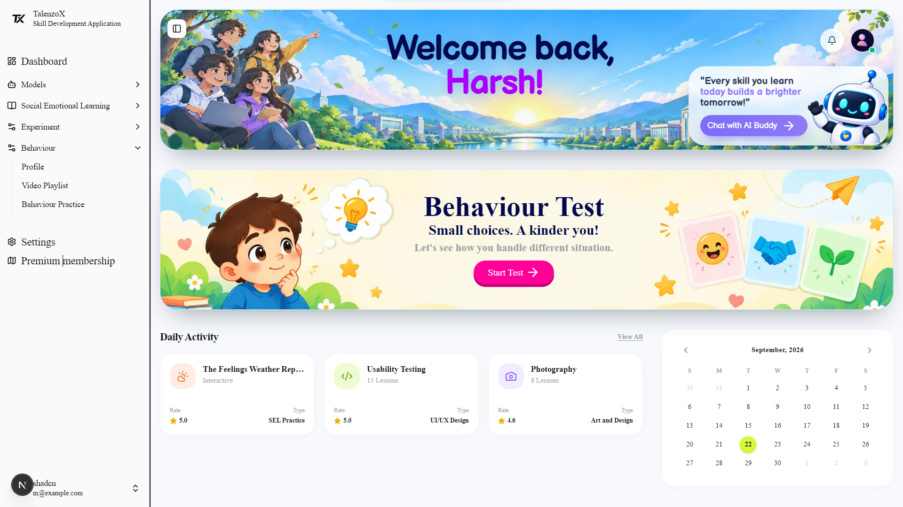

# TalenzoX 🚀

<div align="center">


<p align="center">
  <strong>An Intelligent Learning, Social-Emotional Development & AI-Powered Mentorship Platform</strong>
</p>

<p align="center">
  Empowering young learners, educators, and parents through situational behavioral assessments, real-time voice coaching, and personalized multi-agent learning pathways.
</p>

</div>

---

## 🌟 Overview

**TalenzoX** is an advanced educational technology platform designed to cultivate holistic growth in children and students. Going beyond conventional rote learning, TalenzoX combines **Social-Emotional Learning (SEL)**, **behavioral analytics**, **interactive voice tutoring**, and **AI-guided academic mentorship**.

<p align="center">
  
</p>

---

## ✨ Key Features

### 🧠 AI Behaviour & Personality Assessment
- **Interactive Scenarios**: Scenario-based evaluation designed for young learners (ages 5–7+) to assess empathy, decision-making, and emotional responses.
- **Cognitive Insights**: Analyzes responses and delivers kind, constructive, actionable feedback with strengths and areas for growth.
- **Score Tracking**: Dynamic scoring algorithm tracking progress over time.

### 🎙️ Real-Time AI Voice Tutor
- **Voice-First Learning**: Integrated with the **Vapi AI Web SDK** for hands-free, natural conversations.
- **Custom Voice Personas**: Dynamic voice models tailored to provide supportive and engaging dialogue.
- **Interactive Audio Visualizer**: Live microphone feedback and responsive audio visualizers for maximum immersion.

### 💬 Multi-Agent AI Assistant
- **LangChain & LangGraph Powered**: Architecture capable of coordinating specialized agents (Chat, Search, Summary, and Behaviour).
- **Live Web Research**: Real-time factual query expansion using **Tavily Search API**.
- **High-Speed Inference**: Accelerated LLM responses leveraging **Groq** (`qwen/qwen3.8-27b`) with fallback support for **Google Gemini**.

### 💖 Social-Emotional Learning (SEL) Hub
- **Curated Modules**: Guided lessons on empathy, self-regulation, communication, and emotional resilience.
- **Real-World Practice**: Scenario roleplay to build interpersonal skills.
- **Community Forum**: Safe collaborative space for sharing ideas, feedback, and mutual growth.

### 📊 Modern Student Dashboard
- **Activity & Study Hours Tracking**: Visual charts monitoring daily learning engagement and time allocation.
- **Daily Schedules & Deadlines**: Intuitive timeline widgets for assignments, classes, and tasks.
- **Course Enrollment**: Enrolled subject management with progress meters and quick launch shortcuts.

### ⚡ Performance & State Management
- **High-Performance Caching**: Powered by **Upstash Redis** for low-latency session and data management.
- **Fluid UI & Micro-interactions**: Crafted with **Framer Motion**, **GSAP**, and **Base UI** components.

<p align="center">
  
</p>

---

## 🛠️ Tech Stack

| Domain | Technologies |
| :--- | :--- |
| **Framework** | [Next.js 16](https://nextjs.org/) (App Router, Turbopack) |
| **Frontend Library** | [React 19](https://react.dev/) |
| **Language** | [TypeScript](https://www.typescriptlang.org/) |
| **Styling & UI** | [Tailwind CSS v4](https://tailwindcss.com/), [Shadcn UI](https://ui.shadcn.com/), [Base UI](https://base-ui.com/) |
| **Animations** | [Framer Motion](https://www.framer.com/motion/), [GSAP](https://greensock.com/gsap/) |
| **AI & Multi-Agent** | [LangChain](https://js.langchain.com/), [LangGraph](https://langchain-ai.github.io/langgraphjs/), [Groq](https://groq.com/), [Google GenAI](https://ai.google.dev/) |
| **Voice AI** | [Vapi AI Web SDK](https://vapi.ai/) (`@vapi-ai/web`) |
| **Search Engine** | [Tavily AI](https://tavily.com/) |
| **Database & Auth** | [Supabase](https://supabase.com/) (`@supabase/ssr`, `@supabase/supabase-js`) |
| **Cache & Key-Value** | [Upstash Redis](https://upstash.com/) (`@upstash/redis`) |
| **Icons** | [Lucide React](https://lucide.dev/), [Tabler Icons](https://tabler.io/icons) |

---

## 📁 Project Structure

```text
talenzo-x/
├── public/                 # Static assets, images, and audio resources
├── src/
│   ├── agents/             # LangChain & LangGraph agents (chat, behaviour, search, summary)
│   ├── app/                # Next.js App Router structure
│   │   ├── (main)/         # Main student & core platform layout
│   │   │   ├── ai-assistant/      # AI Chat assistant interface
│   │   │   ├── ai-voice-agent/    # Vapi AI Voice tutoring studio
│   │   │   ├── behaviour/         # Behaviour assessment dashboard & reports
│   │   │   ├── behaviour_test/    # Interactive scenario-based evaluation
│   │   │   ├── experiment/        # Hands-on interactive experiments
│   │   │   ├── home/              # Primary student dashboard
│   │   │   ├── sel/               # Social-Emotional Learning suite
│   │   │   └── user-details/      # Profile configuration & preferences
│   │   ├── (teacher-main)/ # Teacher workspace and class monitoring
│   │   ├── api/            # Route handlers (AI agents, user details, redis, sel)
│   │   ├── auth/           # Supabase SSR authentication (login, signup, reset)
│   │   ├── globals.css     # Global styles & Tailwind v4 theme definitions
│   │   └── layout.tsx      # Root application layout
│   ├── components/         # Reusable UI components & navigation bars
│   ├── config/             # Site metadata, Tavily, and external service configurations
│   ├── hooks/              # Custom React hooks
│   ├── lib/                # Database clients, LLM initializers, Redis, utilities
│   │   ├── graph/          # LLM model routing and LangGraph definitions
│   │   ├── redis/          # Upstash Redis client
│   │   └── supabase/       # Supabase client, server, and middleware configurations
│   ├── services/           # Data & external API service layers
│   ├── types/              # TypeScript interfaces and type definitions
│   └── validation/         # Zod schemas for validation
├── package.json            # Project dependencies & scripts
├── pnpm-lock.yaml          # Lockfile
└── tsconfig.json           # TypeScript configuration
```

---

## ⚙️ Getting Started

### Prerequisites

Ensure you have the following installed on your machine:
- **Node.js**: `v20.x` or later
- **pnpm**: `v9.x` or later (recommended)

---

### Installation

1. **Clone the repository:**
   ```bash
   git clone https://github.com/HarshRaj3050/TalenzoX.git
   cd TalenzoX
   ```

2. **Install project dependencies:**
   ```bash
   pnpm install
   # or
   npm install
   ```

---

### Environment Variables Setup

Create a `.env` or `.env.local` file in the root directory and configure the required keys:

```env
# Application
NEXT_PUBLIC_TALENZOX_URL=http://localhost:3000
NEXT_PUBLIC_API_URL=http://localhost:3000/api

# Supabase Authentication & Database
NEXT_PUBLIC_SUPABASE_URL=https://your-project.supabase.co
NEXT_PUBLIC_SUPABASE_ANON_KEY=your-supabase-anon-key

# AI Model Providers
GROQ_API_KEY=your-groq-api-key
GOOGLE_API_KEY=your-gemini-api-key

# Tavily AI Search
TAVILY_API_KEY=your-tavily-api-key

# Vapi AI (Voice Agent)
NEXT_PUBLIC_VAPI_PUBLIC_KEY=your-vapi-public-key
NEXT_PUBLIC_VAPI_ASSISTANT_ID=your-vapi-assistant-id

# Upstash Redis
UPSTASH_REDIS_REST_URL=https://your-redis-instance.upstash.io
UPSTASH_REDIS_REST_TOKEN=your-upstash-redis-rest-token
```

---

### Running the Application

Start the local development server:

```bash
pnpm dev
# or
npm run dev
```

Open [http://localhost:3000](http://localhost:3000) in your browser to view the application.

---

## 📜 Available Scripts

| Command | Action |
| :--- | :--- |
| `pnpm dev` | Starts the Next.js development server with hot reload |
| `pnpm build` | Creates an optimized production build of the application |
| `pnpm start` | Runs the compiled production server |
| `pnpm lint` | Executes ESLint to check for code quality and syntax issues |

---

## 🤝 Contributing

Contributions are welcome! Please follow these steps:

1. Fork the repository.
2. Create your feature branch (`git checkout -b feature/AmazingFeature`).
3. Commit your changes (`git commit -m 'feat: add some amazing feature'`).
4. Push to the branch (`git push origin feature/AmazingFeature`).
5. Open a Pull Request.

---

## 📄 License

This project is licensed under the MIT License — see the [LICENSE](LICENSE) file for details.

---

<div align="center">
  Made with ❤️ by the <strong>TalenzoX</strong> Team
</div>
